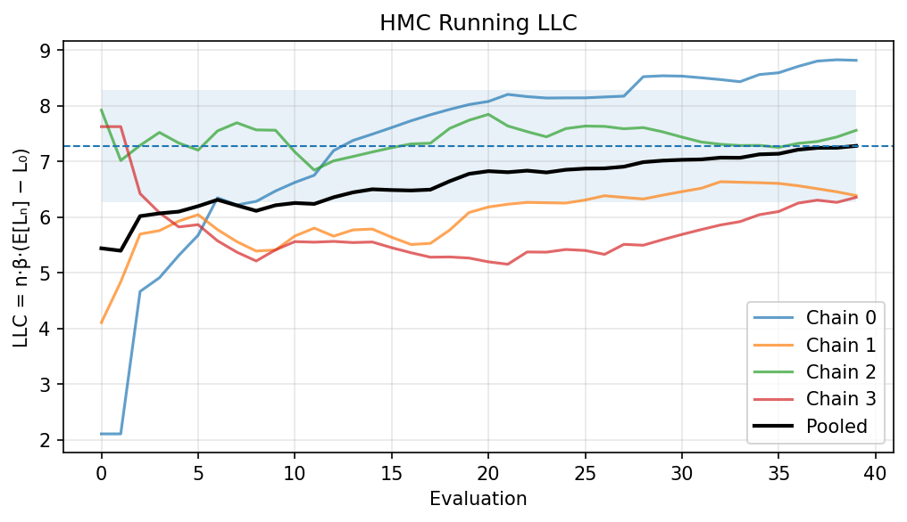

# Local Learning Coefficient Sampler Benchmarks

In [Singular Learning Theory (SLT)](https://singularlearningtheory.com), the **Local Learning Coefficient (LLC)** quantifies the effective local dimensionality of a model around a trained optimum.

This repo provides benchmark estimators of LLC on small but non-trivial neural networks, using standard industrial tooling: [BlackJAX](https://github.com/blackjax-devs/blackjax/tree/1.2.5) for sampling and [ArviZ](https://python.arviz.org/) for diagnostics.

---

## Prerequisites

* **Python versions**

  * **Local:** Python **3.11** or **3.12**

* **Package manager:** [uv](https://github.com/astral-sh/uv)

---

## Quick Start (CPU example)

1. Create an environment:

   ```bash
   uv venv --python 3.12 && source .venv/bin/activate
   uv sync --extra cpu
   ```

2. Run a small experiment:

   ```bash
   uv run llc run --sampler sgld --preset=quick
   ```

3. Analyze the run:

   ```bash
   uv run llc analyze runs/<run_id> --which all --plots running_llc,rank,autocorr,energy,theta
   ```

This generates diagnostic plots such as:





---

## Interpreting Plots

* **Running LLC:** curves should stabilize and agree across chains; divergence = poor mixing.
* **Rank plots:** near-uniform → good; spikes → multimodality/non-convergence.
* **ESS evolution:** should grow and plateau; flat growth → high autocorrelation.
* **Energy (HMC/MCLMC):** distributions should look regular/tight.

More plots are available via `llc analyze` (rank, ESS, autocorrelation, theta traces, energy histograms).

---

## Running Sweeps

### Local Parallel

```bash
uv sync --extra cpu
uv run llc sweep --study study_default.yaml --gpus 0,1,2  # GPU sweep
uv run llc sweep --study study_small.yaml               # CPU sweep
```

### Single Sampler

```bash
uv run llc run --sampler sgld --preset=quick
uv run llc run --sampler hmc --preset=quick
uv run llc run --sampler mclmc --preset=quick
```

---

## Common Tasks

| Task                    | Command                                                     |
| ----------------------- | ----------------------------------------------------------- |
| Single SGLD run         | `uv run llc run --sampler sgld --preset=quick`             |
| Single HMC run          | `uv run llc run --sampler hmc --preset=quick`              |
| Single MCLMC run        | `uv run llc run --sampler mclmc --preset=quick`            |
| Local GPU sweep         | `uv run llc sweep --study study_default.yaml --gpus 0,1`   |
| Local CPU sweep         | `uv run llc sweep --study study_small.yaml`                |
| Analyze saved run       | `uv run llc analyze runs/<run_id>`                         |
| Debug with verbose mode | `uv run llc --verbose run --sampler sgld`                  |


## Configuration

Every run saves its exact configuration to `config.json` in the run directory:

```bash
cat runs/<run_id>/config.json
```


---

## Concepts

* **Job** = (problem, sampler, seed)
* **Family** = jobs sharing (problem, seed) but differing by sampler
* **Sweep** = many jobs + one CSV summary (`llc_sweep_results.csv`)

Sweeps always run one sampler per job.
Attempts are made to cache identical jobs to avoid wating compute.

### Caching

The run hash includes the code version and **only the config fields relevant to the selected sampler**. Changing an HMC parameter does **not** invalidate cached SGLD runs (and vice-versa).

### Families

`run_family_id` groups runs by problem/data/model/seed and **ignores sampler and code version** so you can compare samplers and code upgrades within the same family.

---

## What's in a Run

Each run is **atomic** and executes **exactly one sampler**. The run directory contains a single NetCDF file named after the sampler (e.g. `sgld.nc`) and a `metrics.json` whose keys are prefixed with that sampler (e.g. `sgld_llc_mean`).

```text
runs/<run_id>/
├── config.json          # full configuration
├── metrics.json         # summary statistics (LLC mean/SE, ESS, WNV, timings)
├── L0.txt               # baseline loss at ERM
├── sgld.nc              # traces for SGLD (exactly one sampler per run)
└── analysis/            # generated by `llc analyze`
    ├── *_running_llc.png
    ├── *_rank.png
    └── ...
```

**Sample `metrics.json`:**

```json
{
  "sgld_llc_mean": 145.7,
  "sgld_llc_se": 8.15,
  "sgld_ess": 28.0,
  "sgld_wnv_time": 0.042,
  "sgld_timing_sampling": 12.83
}
```

---

## Defining Sweeps

### Study Files

```yaml
# study_small.yaml
base:
  preset: quick
  n_data: 1000
  chains: 2
problems:
  - name: tiny
    overrides:
      target_params: 2000
samplers:
  - name: sgld
    overrides:
      sgld_precond: adam
  - name: hmc
    overrides: {}
seeds: [0]
```

Run:

```bash
uv run llc sweep --study study_small.yaml
```

---

## Efficiency Metrics (Advanced)

From saved traces we compute:

* **ESS/sec** — effective samples per second
* **ESS/FDE** — effective samples per full-data-equivalent gradient
* **WNV (time/FDE)** — variance × cost for fair comparison

Results are saved to `metrics.json` per run and `llc_sweep_results.csv` for sweeps.

---

## Installation

```bash
uv sync
uv sync --extra modal      # Modal support
uv sync --extra slurm      # SLURM support
```

---

## Features

* Unified CLI for end-to-end LLC estimation
* Three samplers: SGLD, HMC, MCLMC
* Local parallel execution with GPU isolation
* Configurable targets: ReLU MLPs, analytical quadratic
* Full ArviZ diagnostics (ESS, R̂, autocorrelation, rank plots)
* Deterministic caching (reuses runs by config+code hash)

---

## Analysis

Generate diagnostic plots from any completed run:

```bash
uv run llc analyze runs/<run_id> --which all \
  --plots running_llc,rank,autocorr,energy,theta
```

This creates plots in `runs/<run_id>/analysis/` showing:
- Running LLC convergence
- Rank plots for mixing diagnostics
- Autocorrelation functions
- Energy diagnostics (HMC/MCLMC)
- Parameter traces

---

## Implementation Notes

* **SGLD**: Stochastic gradient Langevin dynamics with optional preconditioning (Adam/RMSprop)
* **HMC**: Hamiltonian Monte Carlo via BlackJAX with window adaptation
* **MCLMC**: Microcanonical Langevin Monte Carlo via BlackJAX 1.2.5 fractional API
* **Targets**: MLP (ReLU activation) and analytical quadratic models
* **Caching**: Runs are cached by config hash for identical parameter sets

---

## License

MIT.
